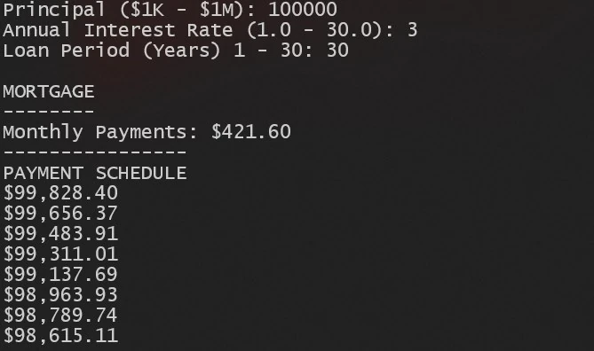

# java-mortgage-calculator

The Java mortgage calculator prompts users for the principal amount of a loan, the annual interest rate, and the loan period. It then calculates the monthly payments until $0 is due.

(Be sure to have openjdk 11.0.16 and Apache Maven 3.6.3 installed on your system before trying the installation instructions below.)



## Installation Instructions

1. Clone the repo:

```sh
git clone https://github.com/xiraynedev/java-mortgage-calculator.git
```

2. Change directory:

```sh
cd java-mortgage-calculator
```

3. Run:

```
mvn package
```

4. Start the project:

```
java -cp target/java-mortgage-calculator-1.0-SNAPSHOT.jar com.xiraynedev.app.App
```
